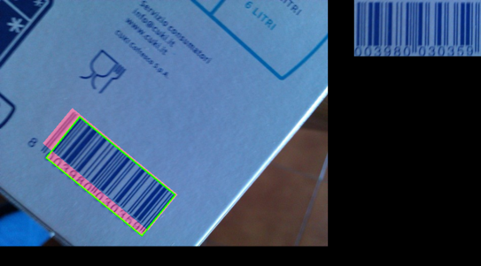
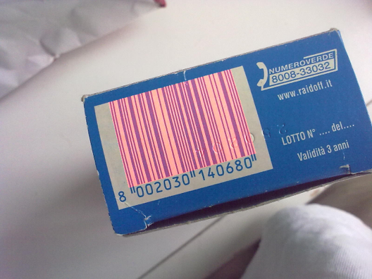
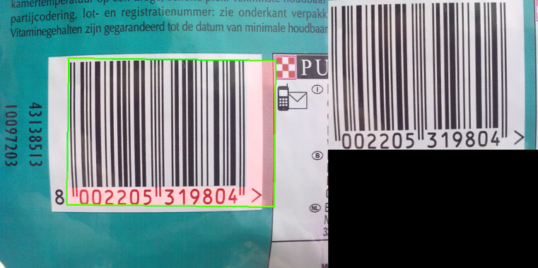
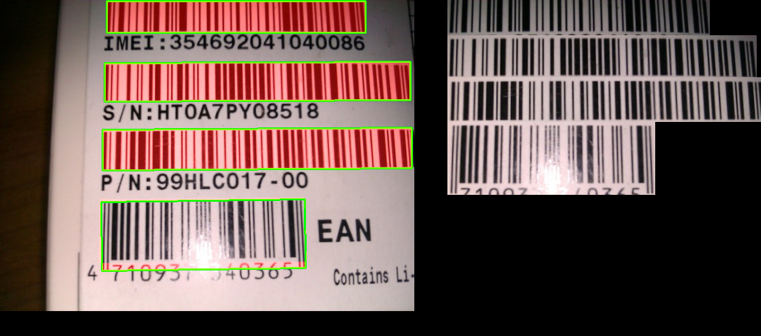

# Object detection for rotated 1D barcodes

This is a python implementation of the barcode detection algorithm described in [creusot2015](http://www.clementcreusot.com/publications/papers/creusot2015-WACV.pdf).

The method aims to find the regions in an image where a 1D barcode is present (rotated bounding box). A Maximal Stable Extremal Region (MSER) method is used to detect the bars which are subsequently clustered into 
barcodes. For the actual decoding of the barcode the [pyzbar](https://github.com/NaturalHistoryMuseum/pyzbar/) library is used.

The project is set up to run against the [ArTe-Lab Rotated Barcode Database](http://artelab.dista.uninsubria.it/downloads/datasets/barcode/hough_barcode_1d/hough_barcode_1d.html), one of the datasets described in the Creusot paper, so that the results of the paper can be verified.

## Performance

The algorithm achieves a mean accuracy (mean IOU) of 0.76 and a mean detection rate (mAP @ 0.5 IOU) of 0.89 on the ArTe-Lab dataset at around 8fps on a 2013 MacBook Pro (CPU).

## Issues
The algorithm works well for for many barcodes and runs at a speed that make it suitable for real-time barcode detection on mobile devices, however it does not perform well for blurry images.

* The algorithm fails to detect the blurry bars on edge of barcode or fails to detect blurry barcodes completely: 

(green: detected region, red: difference to ground truth, right hand side: the extracted image used for decoding)

* As described in Creusot2015, the algorithm fails to detect "non-compliant" barcodes that lack a white margin around margin around the bars. In this case MSER interprets the blue pixels as one area and fails to disconnect the bars from the surrounding area:

* The bars of the area surrounding the barcode are sometimes interpreted as part of the barcode by the clustering algorithm. Creusot2015 describes a post-processing step to resolve this issue, however, since the barcode can be decoded even with the extra area, this is mostly a cosmetic issue and the post-processing step is omitted in this implementation. 

* In some images of the ArTe-Lab dataset only the primary barcode is labeled, this leads to some artificial "error" from the secondary barcodes. 

## Alternatives
The algorithm runs at a speed that make it suitable for real-time barcode detection on mobile devices and works well for most barcodes, but as described above, it performs poorly for blurry images.

A modern object detection algorithm such as [Mask RCNN](https://github.com/matterport/Mask_RCNN) achieves far superior results for blurry images, however this comes at far higher computational costs.

See [this fork](https://github.com/koljascasino/Mask_RCNN) for Mask RCNN that has been trained on 90% of the images of the ArTe-Lab dataset and run against the remaining 10% for testing. The algorithm achieves a mean accuracy (mean IOU of 0.9) and a perfect detection rate (mAP @ 0.5). However, this is only suitable for real-time detection on a dedicated GPU, my 2013 MacBook Pro can only run 0.14fps with a Resnet50 backbone and with the same 640x480px images.     

